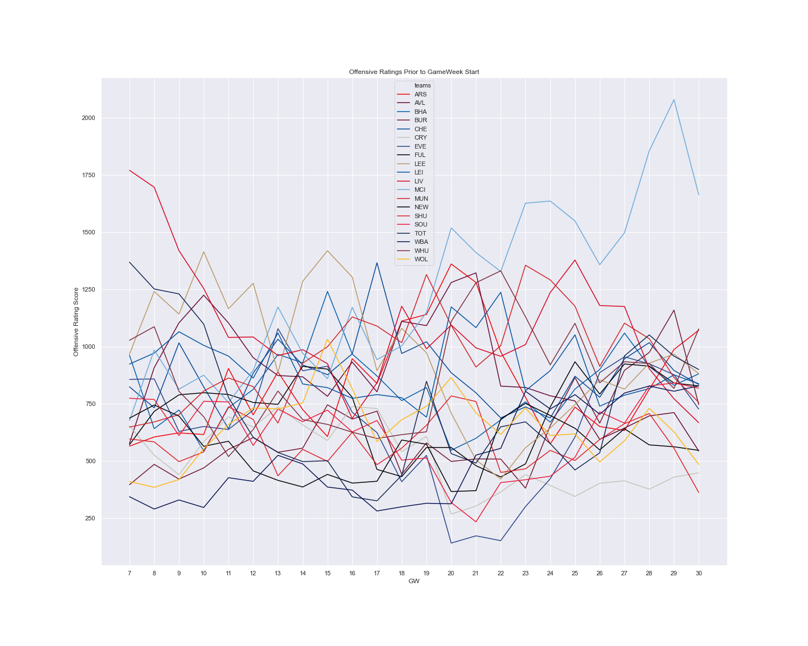
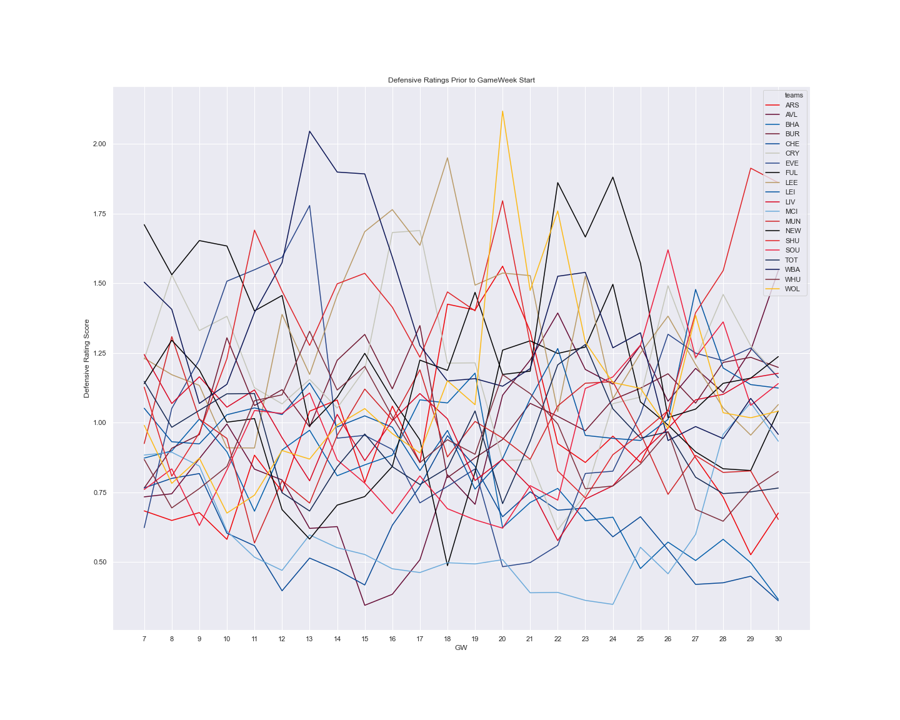

# Offense-Defense Model Applied to EPL
This repository applies the 'Offense-Defense Model' to the English Premier League 2020/2021 season. The Offense-Defense Model is a mathematical model to generate offensive and defensive ratings for each team in a population. It is described in ["Offense-Defense Approach to Ranking
Team Sports"](http://citeseerx.ist.psu.edu/viewdoc/download?doi=10.1.1.141.5694&rep=rep1&type=pdf) (Govan, Langville, Meyer). 
The objective of this application is to create weekly ratings of EPL teams' offensive and defensive form. 
These ratings could be used to compare against subjective opinions of EPL teams, make predictions on game outcomes and inform Fantasy Premier League players on teams to invest in and avoid.

## Data
ODM was originally applied to American football and basketball games, which are typically high scoring. 
In contrast, football (soccer) games typically feature few goals and frequently a team will score 0. This is problematic in the context of applying the ODM model to football for two reasons:
1. A team scoring 0 in a game is equivalent to the team not playing (see data matrix *A* in ODM)
2. The uncommon and discreet nature of goals in a game makes them a poor indicator of offensive/defensive performance (luck and fleeting moments of brilliance/ineptitude can have a significant influence)

### Solution: xG
Expected goals, or xG is a statistical measurement used to more accurately evaluate football performance. 
The xG of a shot is representative of the probability of the shot leading to a goal, and is based on historical data of very similar shots. 
xG of every scoring opportunity can be summed to provide the overall xG scoreline of a game, as illustrated by the example below:
Measure | Liverpool FC | Leeds United
--------|--------------|-------------
Goals | 4 | 3
xG | 3.15 | 0.27

The validity of xG as an indicator for football performance is somewhat contested, however it is widely supported by those invested in statistical and objective football analysis. In this application, xG is used in lieu of goals to fill the data matrix *A*.

### Source disclaimer
xG and other data for this application was sourced from the members area of [Fantasy Football Scout](https://www.fantasyfootballscout.co.uk/), which requires a paid subscription to access.
This repository **does not** reproduce or provide free access to this paid content. To run/modify the provided scripts and pull data from FFS, a user is required to input their paid account details.

## A Novel Approach
The model is tweaked to use only the previous 6 gameweeks of data for each generated rating.
In contrast to the method outlined in the original paper, this ensures the model is more responsive to recent changes in form.
This 'look-back range' can be altered in *odm.py* with the variable *GW_RANGE*.

## Interpreting Results
For offensive ratings, a larger rating score is stronger. For defensive ratings, a lower defense score is stronger. Each rating is prior to the start of the given gameweek, i.e. a teams form heading into that gameweek.
For example, ratings for gameweek 7 are based on xG data from gameweek 1 through 6, and do not include gameweek 7 xG results.

In addition to the generated csv tables of the ratings, images of Seaborn generated plots are provided in the repository as *offensive_ratings.png* and *defesnive_ratings.png*.

### Looking Ahead
The ratings describe that in recent gameweeks and heading into GW30, Manchester City's offensive form is significantly greater than other teams in the league. Arsenal and West Ham are also in relatively good offensive form. Sheffield United, Wolves and Crystal Palace are the teams with the worst offensive form heading into GW 30.

Defensively, Brighton Hove Albion and Chelsea are in the strongest form, by a considerable margin. Manchester City have slipped in recent weeks to place them in 7th best defensive form. Sheffield United and Aston Villa are the teams with the current worst defensive form.

Below are simple seaborn generated lineplots of the ratings data. New dynamic and clean visualizations are discussed in the next section.



## Further Development
* In a few weeks time I will be learning Tableau and using it in a project for my Cloud Computing Applications course. With this experience I intend to create a dynamic and cleaner visualization of the ratings tables and plots. This will replace the visually noisy and static seaborn plots.
* Due to the format of data on FFS, some manual editing is required for 'Double Gameweeks' (where some teams play twice within one gameweek). The scraping script could be adjusted to be more robust to these events, however it would likely be complicated and not necessary as large double gameweeks are rare in non-covid affected seasons.
* The application could feature automatic updates and require less user input by using cloud based services for storage and compute. However, as the application is in early development phase it is not worth the cost.

## Run Instructions
Dependent on python 3.8, selenium, Beautiful Soup 4, Pandas and NumPy
1. Pull data from FFS
    1. Input login details to *login.txt*
    2. Run scrape_fixtures.py with following CLA:
    ```
    python scrape_fixtures.py <last_completed_gw_number>
    ```
    3. In scrape.py edit private stats table link to personal stats table with columns: Team, G, GC, xGC, xG and filtered by arbitrary gameweek.
    4. Run scrape.py for each completed gameweek with following CLA:
    ```
    python scrape.py <gw_number>
    ```
 2. Clean data, perform odm model, generate weekly ratings tables (offense_scores.csv and defense_scores.csv)
    1. Run odm.py with following CLA (may take few minutes):
    ```
    python odm.py <last_completed_gw_number>
    ```
 
